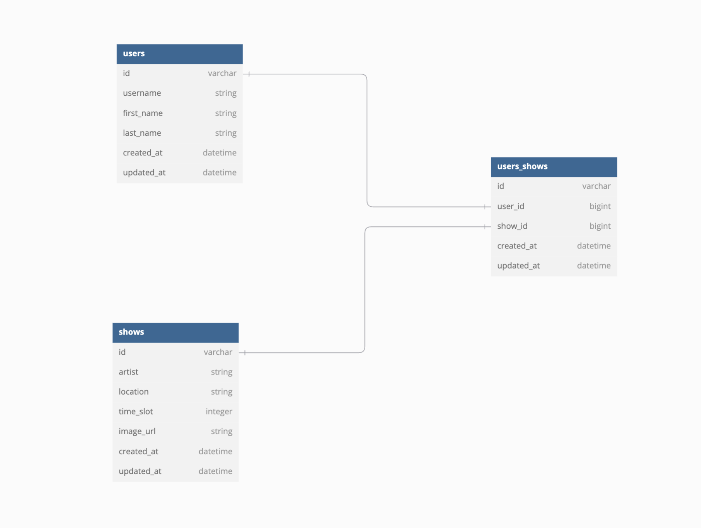

# 🎵 Festival Scheduler - Backend (Rails API)

This Rails API serves as the backend for the Festival Scheduler application. It allows users to view, manage, and interact with festival shows and schedules. The API provides endpoints for managing shows, user schedules, and admin functionalities.

---

## 🚀 Summary

The **Festival Scheduler Backend** is a RESTful API that:
- Manages shows, users, and user schedules.
- Supports many-to-many relationships between users and shows.
- Provides a clean and scalable API design for frontend interaction.

---

## 📸 Walkthrough

### ERD (Entity Relationship Diagram)
  

This diagram outlines the database schema and relationships:
- **Users**: Represents festival-goers.
- **Shows**: Represents scheduled performances.
- **UsersShows**: A join table for managing the many-to-many relationship between users and shows.

---

## 🛠️ Setup Instructions

### Prerequisites
- **Ruby**: 3.2.0
- **Rails**: 7.1+
- **PostgreSQL**

### Running the Server
1. Start the Rails server:
   ```bash
   rails server

2. The API will be available at `http://localhost:3000`.

---

## 🌐 API Endpoints

### **Shows**
1. **Fetch all shows**  
   **Endpoint:** `GET /api/v1/shows`  
   **Description:** Retrieves a list of all festival shows.  
   **Example Response:**
   ```json
   [
     {
       "id": 1,
       "artist": "The Lumineers",
       "location": "Main Stage",
       "time_slot": 1,
       "image_url": "https://example.com/show1.jpg"
     }
   ]
   ```

### **User Schedules**
1. **Fetch a user's schedule**  
   **Endpoint:** `GET /api/v1/users/:user_id/shows`  
   **Description:** Retrieves all shows in the user's schedule.  
   **Example Response:**
   ```json
   [
     {
       "id": 1,
       "artist": "The Lumineers",
       "location": "Main Stage",
       "time_slot": 1,
       "image_url": "https://example.com/show1.jpg"
     }
   ]
   ```

2. **Add a show to a user's schedule**  
   **Endpoint:** `POST /api/v1/users/:user_id/shows`  
   **Request Body:**
   ```json
   {
     "show_id": 1
   }
   ```
   **Example Response:**
   ```json
   {
     "id": 1,
     "artist": "The Lumineers",
     "location": "Main Stage",
     "time_slot": 1,
     "image_url": "https://example.com/show1.jpg"
   }
   ```

3. **Remove a show from a user's schedule**  
   **Endpoint:** `DELETE /api/v1/users/:user_id/shows/:id`  
   **Example Response:**
   ```json
   {
     "message": "Show successfully removed from schedule"
   }
   ```

### **Admin**
1. **Fetch all user schedules**  
   **Endpoint:** `GET /api/v1/users/shows`  
   **Description:** Returns all users and their schedules.  
   **Example Response:**
   ```json
   [
     {
       "user_id": 1,
       "username": "johndoe",
       "schedule": [
         {
           "id": 1,
           "artist": "The Lumineers",
           "location": "Main Stage",
           "time_slot": 1,
           "image_url": "https://example.com/show1.jpg"
         }
       ]
     }
   ]
   ```

---

## 🛠 Features and Design Decisions

1. **Database Design**:
   - A normalized schema ensures scalability:
     - `users` table for user details.
     - `shows` table for festival details.
     - `users_shows` join table for many-to-many relationships.

2. **Error Handling**:
   - Custom error handling using `ErrorSerializer` for consistent error messages.
   - Handles edge cases like duplicate schedules or invalid IDs.

3. **RESTful Routes**:
   - Follows RESTful principles for intuitive and scalable API design.

4. **Validation**:
   - Validates the presence of required fields (e.g., `username`, `artist`).
   - Ensures no duplicate schedule entries for a user.

---

## 🔧 Tech Stack

- **Backend**:
  - Ruby on Rails
  - PostgreSQL
- **Testing**:
  - RSpec for unit and integration tests.

---

## 💡 Future Improvements

1. **Analytics Dashboard**:
   - Add insights for admins, such as most attended shows or busiest time slots.
2. **Permissions and Roles**:
   - Implement user roles for admins and general users.
3. **Batch Operations**:
   - Allow bulk additions or removals of shows for a user.

---

## 📝 Instructions for Testing

1. Run RSpec tests:
   ```bash
   bundle exec rspec
   ```
2. Example test cases include:
   - Validations for `User` and `Show` models.
   - API request specs for endpoints.

---

## 🔍 Additional Resources

- [Rails Documentation](https://guides.rubyonrails.org/)
- [RSpec Documentation](https://rspec.info/)
- [PostgreSQL Documentation](https://www.postgresql.org/docs/)

---
```

